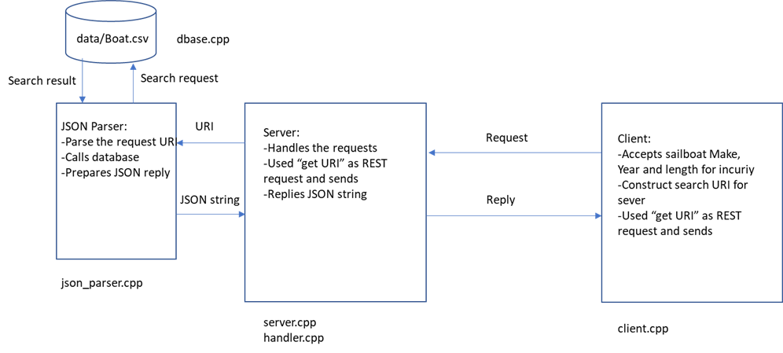

# CPPND: Capstone REST API Implementation for Sailboat Pricing

## by Kemal Tepe, [ketepe@gmail.com](ketepe@gmail.com)

This is a Capstone project in the [Udacity C++ Nanodegree Program](https://www.udacity.com/course/c-plus-plus-nanodegree--nd213).

The Capstone Project illustrates a REST (Restfull API) using Microsoft's Casablanca libraries. The project is primarily developed for a demonstation of how well the principles learned in the Udacity C++ Nanodegree Program. The sofware (SW) architecture is illustrated in figure below. 



The developed REST API functinality is only implemented for GET command, and other HTTP commands like PUT, DELETE, and POST are not implemented. However, the implementation for GET feature can be easily expandable for the other commands. The demonstration of REST API enable a Client (user) to interact with database to search sailboat prices for a given make, year and lenght of sailboat. Rest of this README file explains the installation, and how we meet the requirements for the project rubric.


## Dependencies for Running Locally

* cmake >= 3.9
  * All OSes: [click here for installation instructions](https://cmake.org/install/)
* make >= 4.1 (Linux, Mac), 3.81 (Windows)
  * Linux: make is installed by default on most Linux distros 
* gcc/g++ >= 5.4
  * Linux: gcc / g++ is installed by default on most Linux distros
* In addition to above following libraries needs to be installed
* [CPP Rest sdk libraries developed by Microsoft--formerly Casablana--](https://github.com/microsoft/cpprestsdk), which can be installed with [`sudo apt-get install libcpprest-dev`] in Linux Ubuntu (20.04) distribution.
* [JSON CPP libraries], which can be installed by using [`sudo apt-get install libjsoncpp-dev`] in Linux Ubuntu (20.04) distribution.


## Useful Links

* [Full-fledged client-server example with C++ REST SDK 1.1.0](https://mariusbancila.ro/blog/2013/08/19/full-fledged-client-server-example-with-cpprest-sdk-110/) is extremely useful blog and explains REST API with sample code. 

* [Micro-Service](https://github.com/ivanmejiarocha/micro-service) is another great repo to browse and review to undertand C++ REST API implementation. 
 
## Basic Build Instructions

1. Clone this repo.
2. Make a build directory in the top level directory: `mkdir build && cd build`
3. Compile: `cmake .. && make`
4. Run the Server with: `./Server`
5. Run the Client with: `./Client'

## Running and Expected Behavior


## The following rubric points are addressed with where in the code (i.e. files and line numbers) that the rubric points are addressed.

#### (DONE) A README with instructions is included with the project


#### (DONE) The README is included with the project and has instructions for building/running the project.

#### (DONE) If any additional libraries are needed to run the project 

#### (DONE) The README indicates which project is chosen.

#### (DONE) The README describes the project you have built.

#### (DONE) README also indicates the file and class structure, along with the expected behavior or output of the program.
* ```client.cpp```  performs the client functionality through a terminal application. User needs to enter make, lenth and year of a sailboat.
Then the Microsoft (MS) REST library's web client libary is used to to interact with server. The Client construct the URI string to be sent to the server
to provide the make, length and year information to the server. 

* ```server.cpp``` along with ```handler.cpp```, ```jason_parser.cpp```, ```database.cpp``` files provides implementation of server functionality. '''server.cpp``` is mainly wrapper
for various HTTP command handlers provided in ```handler.cpp`` file and class. 

* ```handler.cpp``` is derived from examples provided by MS REST library documentation. 
* ```jason_parser.cpp``` is a class to parse the URI string to a data structure provided by ```Info_Line``` and interacts with database class included in ```dbase.cpp```. ```Jason_Parser``` class  constructs the JSON string from the ```Info_Line``` stucture returned from the ```Dbase``` class. 

* ```dbase.cpp``` contains the ```Dbase``` class which mimics a database functionality. This can be replaced with a full fledged database implementations like SQL Servers in the future.

* ```info_line.h``` provides structure for the sailboat database interactions. When other features of a sailboat such as engine type, engine power, etc. the structure members can be included without modifying the SW architecture.

* ```utils.h``` holds the simple string split function, which was authored by Kenneth Perkins via (http://programmingnotes.org/)


#### (DONE) The submission must compile and run.

* The project code compiles and runs without errors in Ubuntu 20.04 distribution. It uses cmake/make build system in Linux.

#### (DONE) Loops, Functions, I/O

	
#### (DONE) A variety of control structures are used in the project. The project demonstrates an understanding of C++ functions and control structures. ```for, while, do-while, if,``` control structures are utilized through out the project in almost any file and these are too many to list here.


#### (DONE) The project code is clearly organized into functions. 

I have explained the project code and basic tasks performed in the files included in this project. 


### (DONE) The project reads data from a file and process the data, or the program writes data to a file.
	

* The project reads data from an external file or writes data to a file as part of the necessary operation of the program. In this project for example, the  sailbot information database is stored in /data/boat.csv file, and in ```database.cpp``` file ```boat_read_csv``` function opens the file, and reads the file line by line and contruct a vector of INFO_LINE structure.

```C++
std::vector<Info_Line> Dbase::boat_read_csv(std::string filename)
{

    std::vector<Info_Line> result;

    // Create an input filestream
    std::ifstream myFile(filename);

    // Make sure the file is open
    if(!myFile.is_open()) throw std::runtime_error("Could not open file");

    // Helper vars
    std::string line, colname;

    Info_Line _line;

    // Read the column names
    if(myFile.good())
    {
        // Extract the first line in the file
        std::getline(myFile, line);
    }
    // Read data, line by line
    while(std::getline(myFile, line))
    {
        // Create a stringstream of the current line
        auto xx = Utils::split(line, ",");

        for (std::string t: xx)
            {
                //std::cout << "t : "<< t << std::endl;
                _line.index = std::stoi(xx[0]);
                _line.make = xx[1];
                _line.length = std::stoi(xx[2]);
                _line.year = std::stoi(xx[3]);
                _line.price = std::stoi(xx[4]);
                //std::cout << "line.index : "<< _line.index << " line.price "<< _line.price <<std::endl;
            }
        result.emplace_back(_line);
    }
    // Close file
    myFile.close();
    return result;
};

```


#### The project accepts user input and processes the input.
	

* The project accepts input from a user as part of the necessary operation of the program. In the client functionality in ```client.cpp``` file, sailbot search querries are performed using ```enter_req``` function and this function allows user to enter key parameters of make, length and year of a sailboat that you need to get the price.


```C++

Info_Line enter_req()
{
    int len, year;
    Info_Line _line;
    std::string m;
    
    do {
        std::cout<<"Enter Maker of the sailboat 'ben' for Beneteau and 'jen' for Jenneau: ";
        std::cin>>m;
        if (m == "ben") 
            m = "Beneteau";
        else if (m == "jen")
            m ="Jeanneau";
        else
		    m = "invalid";
	
    } while (m == "invalid");

  do {  
  	std::cout<<"Enter Lenght of the sailboat in feet (40-50): ";
  	std::cin>>len;

	} while (!(len > 39 && len < 51));

  do {  
      std::cout<<"Enter Year that the sailboat was built 1980-2020: ";
      std::cin>>year;

	} while (!(year >= 1980 && year <=2021));

  _line.make = m;
  _line.length = len;
  _line.year = year;

  return _line;
}
```


#### (DONE) Object Oriented Programming

* The project uses Object Oriented Programming techniques. The project has ```Handler, 
 Json_parser, Dbase``` classes. In addition to these, Utils namespace holds the string splitting functionality, and Info_Line structure is used to hold the sailboat information in a structured way and pass this between Json_Parser and Dbase classess. 

* The project code is organized into classes with class attributes to hold the data, and class methods to perform tasks. For example, construction of Json_Parser class is given below.

```C+++

class Json_Parser
{
      public:
       Json_Parser();
       std::string to_string(Json::Value &value);
       void parse_req(std::string req_string);
       Json::Value get() {return _value;};
       std::string get_string();
       std::string get_reply(std::string req_string);
      private:
        Json::Value _value;
        Info_Line _info_line;
        std::mutex _mutex;

};

```


* Classes use appropriate access specifiers for class members. As we have given ```Json_Parser``` class and Dbase as well as Handler classes the members have access specifiers. All the members are specified as public, protected and private as necessary.

* Class constructors utilize member initialization lists and class members that are set to argument values are initialized through member initialization lists.


* Classes encapsulate behavior. For example in the Dbase class, the run_db function used private member functions and encapsulates the other database actions.

```C++
	class Dbase 
{
    public:
        int run_db(Info_Line boat_type);

    private:
        std::vector<Info_Line> boat_read_csv(std::string filename);
        int get_price(const std::vector<Info_Line> &db, Info_Line asking_price);  
}; 
```

* Overloaded functions allow the same function to operate on different parameters. I overloaded the Info_Line structure constructor, which can be done with classes as well. 

```C++

struct Info_Line{
    int index;
    std::string make;
    int length;
    int year;
    int price;

    Info_Line () {}

    Info_Line (std::string m, int l, int y)
    {
        make = m;
        length = l;
        year = y; 
    }

};
```


## (DONE) Memory Management
Criteria 	Meets Specifications

* This project did not include much of the Memory management features. However some of the memory management concepts like unique, and shared pointers can be used more to improve the project's memory utilization and avoid any memory leaks. 

* The project makes use of references in function declarations. At least two variables are defined as references, or two functions use pass-by-reference in the project code. For example in Json_Parser class to_string uses references as the function input. 

```C++

std::string to_string(Json::Value &value);

```


## (DONE) Concurrency

* The project uses multithreading. The project uses multiple threads in the execution. 

Concurrency is inherently implemented in the MS REST API library functions, and I mainly utilized these libraries in the server side of the API. 

* A promise and future is used in the project. A promise and future is used to pass data from a worker thread to a parent thread in the project code.

MS REST API implementation used ```.then``` to provide a future and promise in the library. 

* A mutex or lock is used in the project.


	

A mutex or lock (e.g. std::lock_guard or `std::unique_lock) is used to protect data that is shared across multiple threads in the project code.

** A condition variable is used in the project.
	

A std::condition_variable is used in the project code to synchronize thread execution.


